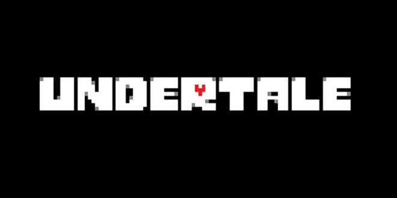
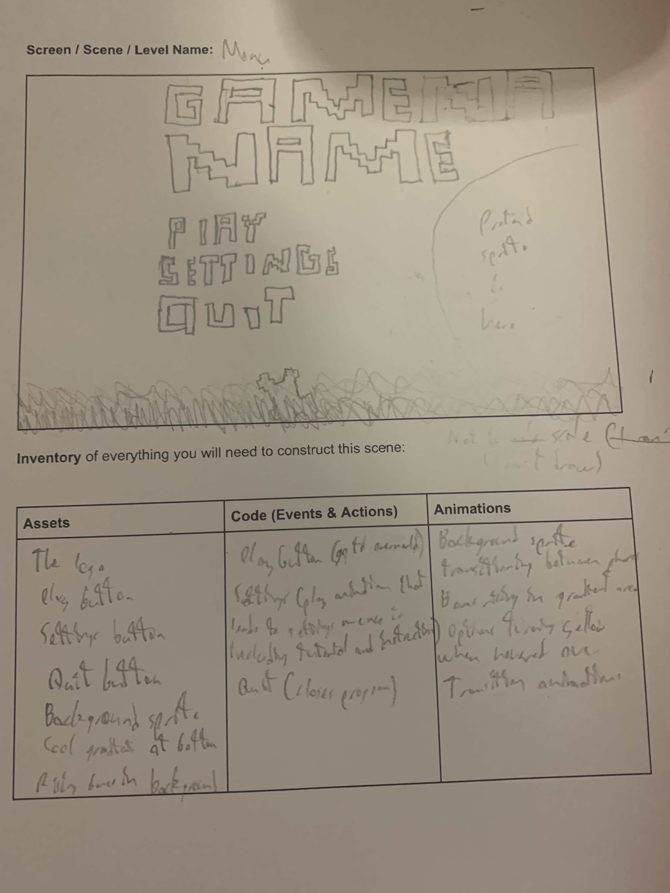

# **Identifying a Need**
---
---
---

# **Brainstorming**
---
---
## **Mechatronics-based game**
|P|M|I|
|-|-|-|
|Interactive|I suck at coding Mechatronics|Connected to the real world|

## **Python-based game**
|P|M|I|
|-|-|-|
|Easier to code|More simplistic|-|
|-|Less interactive|-|

## **Unity - 2D Platformer**
|P|M|I|
|-|-|-|
|Simple controls|Generic|Has a large area for original ideas|
|Easy to code|Less interactive|-|

## **Unity - 3D Roll a Ball**
|P|M|I|
|-|-|-|
|Simple controls|Unoriginal and boring|May have area for gimmicks|
|Direct Tutorial|Less interactive|-|

## **Unity - 2D Roguelike**
|P|M|I|
|-|-|-|
|Simple controls|Repetitive gameplay loop|Large amount of room for originality|
|Direct Tutorial|-|-|

## **Unity - Top Down RPG**
|P|M|I|
|-|-|-|
|Simple controls|Repetitive gameplay loop|Large amount of room for originality|
|Direct Tutorial|Unoriginal|RPGs tend to be hard to execute well but if done correctly can work well|

## **Undertale Fangame**
|P|M|I|
|-|-|-|
|Challenging|Requires prior skill to play|Based on a prior fanbase|
|Reasonably possible (similar has been made in Scratch)|Limited Audience|My personal choice|
|Top Down RPG code can be useful|SO MUCH SPRITE/MUSIC DESIGNING|Not directed towards a specific gender|

---
---

# **Need-Problem Statement**
---
---
## **Need:**
---
To provide an entertaining challenge for veteran players of the original game (and possibly an easier version for beginners)

---
## **Problem Statement**
---
Nearly all games are made for the purpose of entertainment, hence each game is made to cater to a specific audience of people who enjoy a specific aspect, my game is intended for prior players of Undertale using similar mechanics and some unique ones to create a unique challenge for the player, although there are already many Undertale fangames, there is no harm in having another (as long as it's well developed)

---
## **Skill Development**
---
Firstly to possibly develop a small overworld and develop the battle mechanics I will likely have to use the [2D Top Down RPG Tutorial](https://www.youtube.com/watch?v=JmyRnlXbZcA&list=PL6bqhqO0Ba776ksb3F9P_xmUMT9WvmfFT&index=51) (the other tutorial is blocked) and for the rest of the game I'll likely have to recreate scratch projects in Unity or try and find general help online.

---
---

# **Requirements Outline**
---
---
## **Inputs**
---
Be able to recieve keyboard inputs for menu navigation, general movement and inputs and recieve mouse clicks for hidden easter eggs.

* User inputs with directional arrows keys or WASD to move in the corresponding direction (in the menu, in the battle or in the overworld)
* User inputs with Z, X and C keys to interact with the menu (Z to interact, X to exit the specific part of the menu, C to quickly skip dialogue)
* User may be able to hover the cursor over specific areas of the screen and click to activate an easter egg
---
## **Processing**
---
The program is able to update variables based on previously mentioned inputs and collision with 'bullets' as well as in-game events.

* After the user input for movement the game will move the player across the menu or in the battle in the correspondingly related direction to the input, it will check to see if the movement is possible, if not nothing will happen
* After the user inputs a non-movement menu input it will update the menu depending on which option was selected, it will process which input it was
* After the user clicks in the correct place the program will update a related variable for the easter egg or immediately show it
* If the player has a skill issue and they get hit by a 'bullet' they will lose a set amount of health and recieve KARMA damage, the program will process the damage and if it is the end of the turn, the amount of KARMA
* If the user's health is 0 a small death animation will be played before being taken to the game over screen
* If the player wins a cutscene will be triggered (this may lead to further phases)
---
## **Outputs**
---
The program shows the user the corresponding movement/menu change/gameover/easter egg based on the previously mentioned process.

* When the player moves they will see the player character move (in battle or in the overworld)
* When the player moves in the menu they will the menu option change
* When the player inputs in the menu they will see the menu change
* When the player gets hit the displayed health will lower and the displayed KARMA will increase and a sound will play for every hit (no i-frames because the damage will be low)
* When the player triggers an easter egg it will be seen and they may recieve an achievement for it (also shown on screen)
* If the player dies they will see the death animation before being sent to the gameover screen (which they will also see)
* If the player wins they will witness a cutscene
---
## **Transmission**
---
**NIL**

---
## **Storage**
---
Achievements and in-game progress (via checkpoints) is saved locally

* When the player earns an achievement it will be saved
* When the player reaches a checkpoint it will be saved
---
---
# **Functional Requirements**
---
---
## **User Interactions**
---

The user will able to use keyboard inputs (and some mouse clicks) to input (refer to the entire **Inputs** section), to summarise the player will be able to move around, in the menu, overworld and battle, the player will be able to interact with the regular menu and battle menu and the player may be able to click in specific places to trigger... some secrets (exact details in the **Inputs** sections)

i.e.
* User inputs with directional arrows keys or WASD to move in the corresponding direction (in the menu, in the battle or in the overworld)
* User inputs with Z, X and C keys to interact with the menu (Z to interact, X to exit the specific part of the menu, C to quickly skip dialogue)
* User may be able to hover the cursor over specific areas of the screen and click to activate an easter egg
---
## **Core Gameplay or Simulation Mechanics**
---

* Movement (Overworld/Battle)
  - The user presses one of the arrow keys/WASD
  - The player character moves in the corresponding direction
     - Diagonal movement is possible in battle
* Movement (Menu/Battle Menu)
  - The user uses the arrow keys/WASD to switch between options in the menu
     - In battle the user may need to dodge in the menu 
  - The Z key is used to select an option and the X key is used to go back to the previous menu
* Combat
  - When the user triggers the fight they will be given a menu with 4 options: FIGHT, ACT, ITEM and MERCY (the last of which will be cracked)
  - Selecting FIGHT will give the player a small minigame where they must land a moving line as close to the center as possible to deal as much damage as possible
  - Selecting ACT will give the player further options for interaction, they may or may not have an effect
  - Selecting ITEM will give the player their inventory, they will be able to interact with items in it to heal
  - Selecting **~~MERCY will allow the player to spare the enemy given that the enemy also wants to spare the player~~**
  - Whatever option is chosen the player will have to dodge an attack via dodging a 'bullet pattern' (bullet hell type stuff) via movement
  - The user will be able to skip dialogue, Z proceeds to the next part of the dialogue, X immediately displays the segment of dialogue and C immediately displays and then skips the segment of dialogue and is the only one able to be held down
---
## **Scoring and Feedback**
---
* Achievements
  - The user reaches certain milestones or find secrets they will be awarded achievements (this is basically the only scoring type thing)
---
## **Level Progression or Simulation Stages** 
---
* Phases
  - The user actually manages to defeat the enemy, some cool cutscene happens which moves the player to the next phase, they recieve a checkpoint every phase
---
## **Saving and Loading Data**
---
* Progress
  - Progress (achievements and checkpoints) will be saved locally and accessed and loaded when the game is opened
---
---
# **Non-Functional Requirements**
---
---
## **Performance Requirements**
---
* The game should be able to load quickly (there isn't even that much to load) within at most 5 seconds
* Inputs should have nigh-immediate responses
* There should be **NO** noticable lag
---
## **Usability Requirements**
---
* Although the game is made for people who know how to play already there will be a tutorial option explaining all the mechanics of the game.
* The Menu UI should be simple enough for new players to be able to navigate with ease
---
## **Compatibility Requirements**
---
* The game must be entirely compatible with PC
---
## **Scalability Requirements**
---
* The game should be able to handle extensions to the overworld and more battles without any noticible decrease in performance
---
## **Security Requirements**
---
* **Nil**
---
## **Reliability and Availability**
---
* The system should almost always be available
* There will be some kind of autosave system incase the game randomly crashes
---
---
# **Consideration of Social and Ethical Issues**
---
---
## **Definitions**
---
### **Equity**
Equity is being fair, giving aid to those that need it rather then evenly distributing resources, equity aims to give everyone an even playing field.
### **Accessibility**
If something is accessible then it is easily usable even for those that are disadvantaged, accessibility is the noun form of accessible, it being the quality of being accessible.

---
## **Accessibility**
---
Only small differences are nessecary for a project like this since most things use both visual and audio indicators and the main colour scheme is black and white, however one change that would be useful is an option to bind certain keys to certain inputs to increase the accessibility of the project, some people may have broken keys on a keyboard which can be irritating when you are attempting to play a game that requires such an input so allowing the user to 'remap' inputs, binding them to certain keys will allow for more players to play the game.

---
## **Privacy and Data Protection**
---
The project does not collect user data. (What else am I suppossed to say?)

---
## **Fairness and Representation**
---
The player character is of no clear race and is intentionally gender ambigious (just like the original) hence there is no ability for any kind of misrepresentation when the only human character is generally ambigious.

---
## **Mental and Emotional Wellbeing**
---
For this project it is hard to know, the original Undertale was based around the ability to spare or kill, punishing the player for choosing the latter, the game is set in a world where the player chose the latter, however mercy is still an option even if hard to achieve at the point the game is set, if the player chooses violence then it was their choice, whether it be for curiosity or simply because they wanted a **real** challenge...

---
## **Cultural Sensitivities**
---
We have funny skeleton man... I wouldn't be surprised if there were some cultures where a skeleton could be considered offensive... but that's about it... there's no plan for religious/cultural imagery to be included **anywhere** in the game.

---
---
---
# **Researching and Planning**
---
---
---
# **Exploration of Existing Ideas**
---
---
(Considering that this is a fangame this will be compared to the original game... and 2 other fangames)
|Example|Image|P|M|I|
|-|-|-|-|-|
|**Undertale**||The game has an amazing story with relatively simplistic visuals that simply just work well with the game, the game gives the player choices which decide the story's trajectory, you can spare everyone and befriend all the major characters to get the game's best ending, spare some and kill some to get a regular ending or... go down a dark path and meet the consequences of your actions, the game is also known for its hidden story, the secrets which players discover just by messing around, Undertale is known to be an amazing game which is why it has such a large fandom (many of which may have never even played the game lol) and it the reason I'm making my project what it is.|It's hard to say what exactly is bad about Undertale other then the usual bugs and glitches, the only major thing you may consider negative is just how dark the game can become when you choose to be a terrible person...|This project is a fangame, it takes the positive aspects of Undertale but will likely take the minuses as well... it will be difficult to create something even remotely similar to the original.|
|**Undertale Yellow**||This fangame was made as an unofficial prelude to Undertale (although the creator of Undertale made it canon to the story), I've only played through the first area of the game but from my experience it does live up to the original in quality even adding new features which many have wanted, the fangame allows for the user to take similar paths as Undertale although the punishment for choosing the... bad path is even higher then in Undertale.|The game does take on an overall darker undertone then Undertale in both the neutral and the... **other** route... the player character's goal is to bring retribution for the previous humans... although in the... **other path** this is taken to an extreme extent to the point that the player is obviously placed in the wrong, the neutral route ending can be considered rather distrubing in it's final fight although it does create the required atmosphere.|Overall this fangame was a good remake of Undertale's concepts staying true to the original and improving upon it, however I feel as if the game is sometimes slightly too dark... **but that's what the they deserve for what they've chosen to do...**|
|**Outertale**||This is the only Undertale fangame I entirely completed and it was an overall fun experience introducing some interesting twists to differienate from the original game, it added many more routes for the game to take but also sometimes forced the hand of the player likely to limit the amount of variation, they did add an extra section for the community with several unique mechanics expanding on the story, it was an amazing fangame for the limited idea it was based upon (Undertale but space)|I feel as if some aspects of the game were made too boring even in the better endings, sometimes you'll have to keep walking for almost 10 minutes with no encounters creating a rather boring experience. Although the game does try to take a lighter tone then the original one ending is... incredibly dark...|The extra endings and lighter tone can be useful for my game.|

---
---
# **Flowchart and Pseudocode Example**
---
---
## **Flowcharts**
---
### **Movement - Menu**

### **Movement - Menu - Battle**

### **Movement**

### **Dialogue**

### **Achievement**

### **Transition**

### **Loading autosaved data**

---
## **Pseudocode**
---
### **Movement - Menu**
~~~
BEGIN Movement(Menu)
  WHILE On menu
    INPUT userkeyboardInput
    IF 'A' pressed THEN
      IF 'Left' valid movement THEN
        Move menu option left
      ENDIF
    ELSE IF 'D' pressed THEN
      IF 'Right' valid movement THEN
        Move menu option right
      ENDIF
    ELSE IF 'W' pressed THEN
      IF 'Up' valid movement THEN
        Move menu option up
      ENDIF
    ELSE IF 'S' pressed THEN
      IF 'Down' valid movement THEN
        Move menu option down
      ENDIF
    ELSE IF 'Z' pressed THEN
        Next menu
        IF 'No next menu' THEN
          break
        ENDIF
    ELSE IF 'X' pressed THEN
      IF 'Previous menu' real THEN
        Previous menu
      ENDIF
    ENDIF
  ENDWHILE
END Movement(Menu)
~~~
### **Movement - Menu - Battle**
~~~
BEGIN Movement(Menu - Battle)
  WHILE On menu
    INPUT userkeyboardInput
    IF 'Player' touching 'bullet'
      Player loses 10 health and recieves 1 KARMA every frame
    ENDIF
    IF 'A' pressed THEN
      IF 'Left' valid movement THEN
        Move menu option left
      ENDIF
    ELSE IF 'D' pressed THEN
      IF 'Right' valid movement THEN
        Move menu option right
      ENDIF
    ELSE IF 'W' pressed THEN
      IF 'Up' valid movement THEN
        Move menu option up
      ENDIF
    ELSE IF 'S' pressed THEN
      IF 'Down' valid movement THEN
        Move menu option down
      ENDIF
    ELSE IF 'Z' pressed THEN
        IF Button is 'FIGHT' THEN
          Fight menu
          IF 'Z' presed THEN
            IF distance from center is less then 1 THEN
              crit bonus is crit bonus damage
            ELSE
              crit bonus is 0
            ENDIF
            damage dealt is attack/distance from center + crit bonus
            Enemy loses health equalivent to damage dealt
          ELSE IF 'X' pressed THEN
            IF 'Previous menu' real THEN
              Previous menu
            ENDIF
          ENDIF
        ELSE IF Button is 'ITEM' THEN
          Switch to ITEM menu
          IF 'Z' pressed THEN
            Find amount healed by healing item
            Find amount of health missing
            IF amount of health missing is greater then amount healed by healing item THEN
              increase playerhealth by amount healed by healing item
            ELSE
              playerhealth is maxhealth
            ENDIF
          ELSE IF 'X' pressed THEN
            IF 'Previous menu' real THEN
              Previous menu
            ENDIF
          ENDIF          
        ELSE IF Button is 'ACT' THEN
          Switch to ACT menu
          IF 'Z' pressed THEN
           trigger dialogue
          ELSE IF 'X' pressed THEN
            IF 'Previous menu' real THEN
              Previous menu
            ENDIF
          ENDIF
        IF 'No next menu' THEN
          break
        ENDIF
        ELSE IF Button is 'MERCY' THEN
          Switch to MERCY menu
          IF 'Z' pressed THEN
           trigger dialogue
          ELSE IF 'X' pressed THEN
            IF 'Previous menu' real THEN
              Previous menu
            ENDIF
          ENDIF
        IF 'No next menu' THEN
          break
        ENDIF
    ELSE IF 'X' pressed THEN
      IF 'Previous menu' real THEN
        Previous menu
      ENDIF
    ENDIF
  ENDWHILE
END Movement(Menu - Battle)
~~~
### **Movement**
~~~
BEGIN Movement
  WHILE Movement possible
    INPUT userkeyboardInput
    IF 'Player' touching 'bullet'
      Player loses 10 health and recieves 1 KARMA every frame
    ENDIF
    IF 'A' pressed THEN
      IF 'Left' valid movement THEN
        Move left
      ENDIF
    ELSE IF 'D' pressed THEN
      IF 'Right' valid movement THEN
        Move right
      ENDIF
    ELSE IF 'W' pressed THEN
      IF 'Up' valid movement THEN
        Move up
      ENDIF
    ELSE IF 'S' pressed THEN
      IF 'Down' valid movement THEN
        Move down
      ENDIF
    ENDIF
  ENDWHILE
END Movement
~~~
### **Dialogue**
~~~
BEGIN Dialogue
  INPUT userkeyboardInput
  If 'Z' pressed THEN
    IF dialogue segment ended THEN
      Begin next dialogue segment
    ENDIF
  ELSE IF 'X' pressed THEN
    Display dialogue segment
  ELSE IF 'C' pressed THEN
    WHILE 'C' is pressed
      Fully display and skip dialogue segment
    ENDWHILE
  ENDIF
END Dialogue
~~~
### **Achievement**
~~~
BEGIN Achievement
  INPUT playerachievement
  IF playerachievement is TRUE THEN
     FOR achievement in achievementlist
       check if it is right achievement
       IF achievement is correct THEN
         BREAK
       ENDIF
      ENDFOR
  ENDIF
END Achievement
~~~
### **Transition**
~~~
BEGIN Transition
  IF battleended is TRUE THEN
    trigger cutscene
    Phasenum increases by 0.5
    CALL Battle
  ELSE
    CALL Battle
  ENDIF
END Transition
~~~
### **Loading**
~~~
BEGIN Load
  FOR every achievement in achievementlist THEN
    IF achievement is achieved THEN
      Award achievement
    ENDIF
  ENDFOR
  FOR every checkpoint in checkpointlist THEN
    IF checkpoint has been reached THEN
      Allow access to checkpoint
    ENDIF
  ENDFOR
END Load
~~~
---
---
## **Gnatt Chart**
---
---

---
---

## **Storyboards**
---
---
### **Storyboard 1 - Menu**

### **Storyboard 2 - Battle Menu**

(This is the closest there is to a "level")
### **Storyboard 3 - Game over**

### **Storyboard 4 - Whole Game Flowchart**

---
---

**THEJ END**
---

(Go play my platformer game if you haven't already)

---
---
---